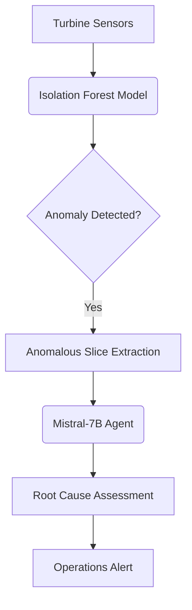

# Turbine Anomaly Detection Agent

> **Real-Time Power Plant Monitoring with Isolation Forest & LLM Root Cause Analysis**

[](https://opensource.org/licenses/MIT)
[](https://davidfernandez.dev)
[](https://huggingface.co/spaces/davidfertube/anomaly-agent)
[](https://www.python.org/)

## Overview

**Anomaly Agent** provides real-time turbine monitoring with automated root cause analysis using Isolation Forest and LLM-powered diagnostics. Gas turbines generate massive sensor streams—manual monitoring misses subtle anomalies that precede forced outages. This system detects anomalies in vibration, temperature, and pressure data, then automatically performs root cause analysis.

## System Architecture



## Key Features

- **Multi-Variate Detection**: Processes temperature, pressure, and vibration simultaneously
- **Agentic RCA**: Mistral-7B performs deep-dive analysis of anomalous data points
- **Real-Time Visualization**: Interactive Plotly dashboards highlighting anomalies
- **Automated Triage**: Classifies anomalies into severity levels to reduce alert fatigue

## Technical Stack

| Component | Technology |
|-----------|------------|
| Anomaly Detection | Scikit-Learn (Isolation Forest) |
| RCA Agent | Mistral-7B (HF Inference) |
| Visualization | Plotly, Gradio |
| Infrastructure | Python 3.9+ |

## Quick Start

```bash
git clone https://github.com/davidfertube/iot-anomaly-agent.git
cd iot-anomaly-agent
pip install -r requirements.txt
python app.py
```

## Project Structure

```
iot-anomaly-agent/
├── src/
│   └── anomaly_engine.py  # Isolation Forest & LLM RCA logic
├── app.py                 # Gradio Dashboard
└── requirements.txt
```

## Energy Industry Applications

- **Gas Turbine Monitoring**: Detect vibration and heat rate anomalies before forced outages
- **Compressor Health**: Monitor discharge pressure and temperature deviations
- **Generator Performance**: Track efficiency drops and bearing wear patterns

---

**David Fernandez** | Applied AI Engineer | LangGraph Core Contributor

- [Portfolio](https://davidfernandez.dev) • [LinkedIn](https://linkedin.com/in/davidfertube) • [GitHub](https://github.com/davidfertube)

MIT License © 2026 David Fernandez
